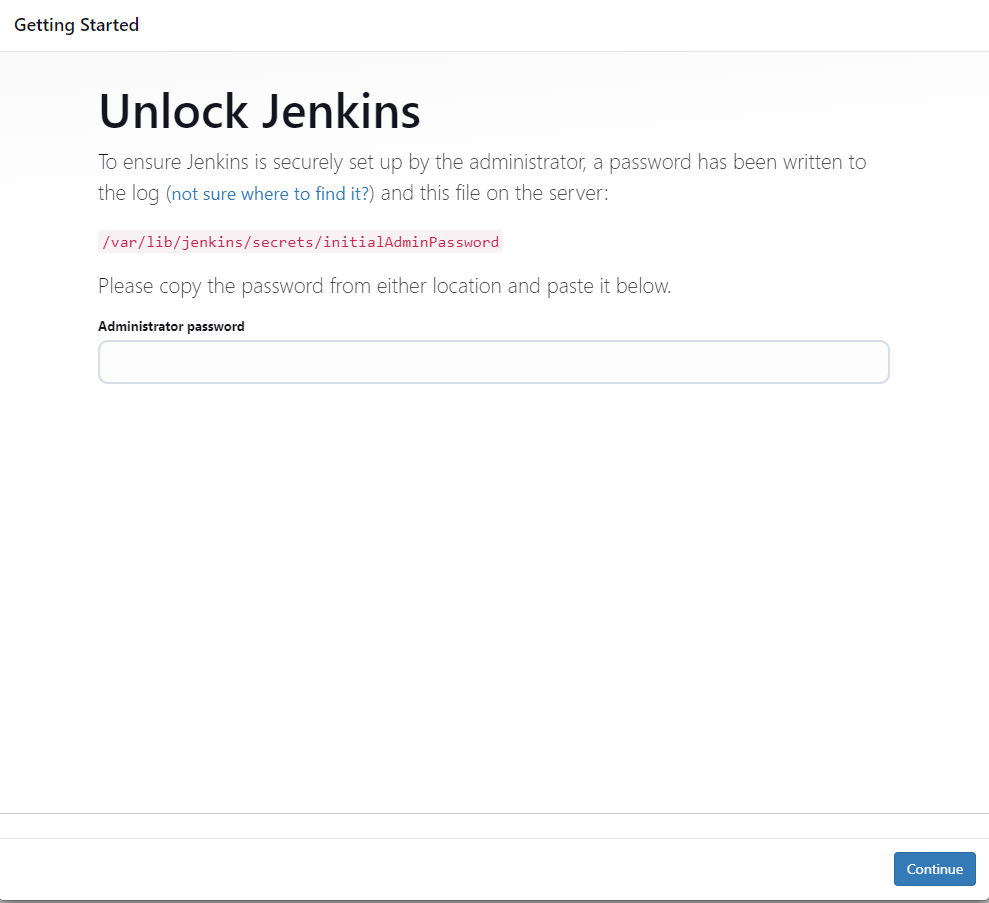
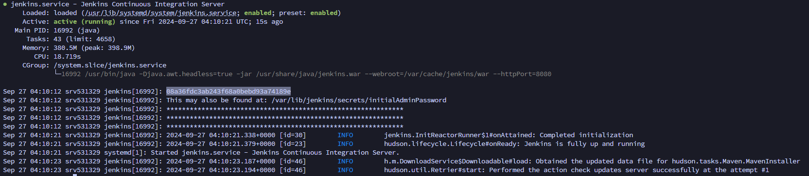

# Post installation setup wizard

After downloading, installing and running Jenkins using one of the procedures above (except for installation with Jenkins Operator), the post-installation setup wizard begins.

This setup wizard takes you through a few quick "one-off" steps to unlock Jenkins, customize it with plugins and create the first administrator user through which you can continue accessing Jenkins.

## Unlocking Jenkins

When you first access a new Jenkins controller, you are asked to unlock it using an automatically-generated password.

1. Browse to [localhost:8080](http://localhost:8080) (or whichever port you configured for Jenkins when installing it) and wait until the Unlock Jenkins page appears.
   
2. rom the Jenkins console log output, copy the automatically-generated alphanumeric password (between the 2 sets of asterisks).
   

Note:
The command: **sudo cat /var/lib/jenkins/secrets/initialAdminPassword** will print the password at console.
